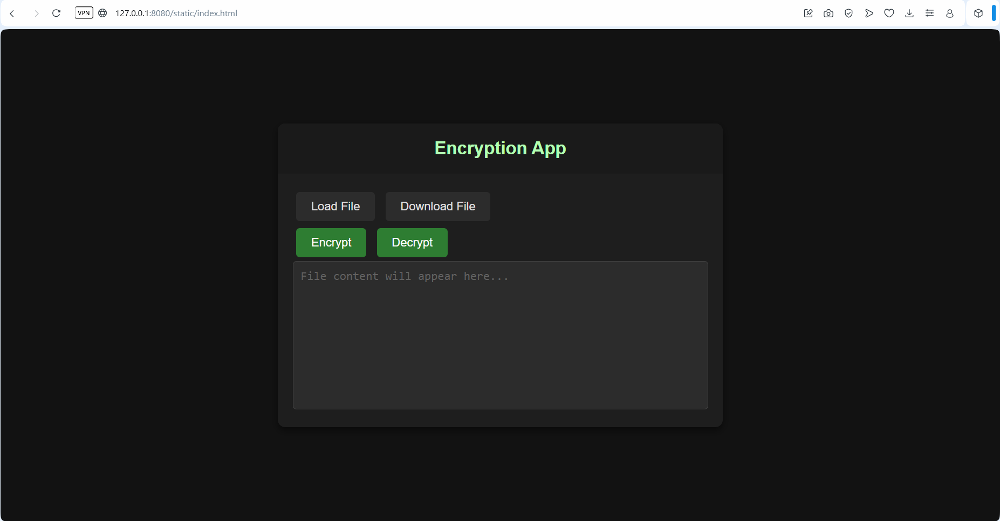

# Fullstack_CaesarCipher
Fullstack web encryption app with caesar cipher implementation
For now this works only with .txt files

The server will create folders in your project directory for:
  uploaded **(/uploaded)**, 
  encrypted **(/encrypted)**, 
  decrypted **(/decrypted)** files

**your_project_dir/cargo run** will run at local host <ins>http://127.0.0.1:8080/static/index.html</ins>

Used libraries:
  actix-web
  actix-files
  actix-multipart
  serde
  futures-util
